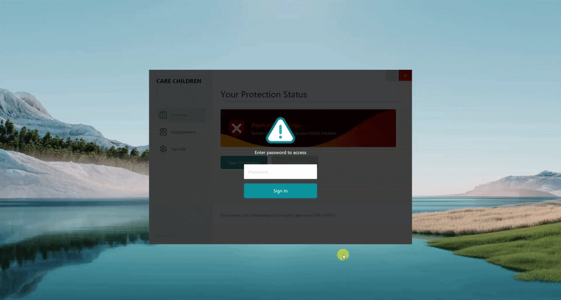

# 🛡️ Care Children

Care Children System is a Windows-based parental control application built using the Rust programming language. This application is designed to create a safe internet environment for children by automatically blocking harmful content and running silently (stealth mode).



## 🌐How to use
*  Run the program with Run as Administrator
*  Enter the default password **admin123**
*  Enter a list of blocked websites
*  Click start protection (The program runs stealthily)
*  To reopen, press **CTRL+SHIFT+L**

## 🚀 Main Features

* HTTPS & DNS Filtering: Monitors and blocks access to prohibited domains.
* Stealth Mode: The application runs in the background without a console window (pure GUI).
* Admin Protection: Equipped with a password system to prevent children from changing settings.
* Auto-start: Integrated with the Windows Registry to automatically activate when the computer is turned on.
* System Integration: Automatically manages Firewall and DNS Cache rules.
* Modern UI : Clean and intuitive interface using the `Iced` library.

## 📁 Distribution File Structure

Inside the release folder, you will find 3 main files:

1. **`care-children.exe`**: The main program. Must be run as **Administrator**.
2. **`compile.exe`**: A program for developers to reduce the size of `.exe` files (using UPX).
3. **`cleanup-care-children.exe`**: A program to remove all traces of the program (Registry, Firewall, & Tasks) from the system.

## ⚙️ System Requirements

* **Operating System**: Windows 7, 8, 10, or 11 (64-bit).
* **Privileges**: Requires **Administrator** privileges.
* **Dependency**: Microsoft Edge WebView2 Runtime (usually already present on Windows 10/11).

## 🛠️ Development Guide (Developer)

If you want to recompile from source:

### 1. Prerequisites
* Install Rust (https://rustup.rs/) (Use the `stable-x86_64-pc-windows-msvc` toolchain).
* Install Visual Studio Build Tools (https://visualstudio.microsoft.com/visual-cpp-build-tools/) with the "Desktop development with C++" component.

### 2. Build Project
# Clone repository
```bash
git clone [https://github.com/username-kamu/guard-children-internet.git](https://github.com/username-kamu/guard-children-internet.git)
```
# Go to folder
```go
cd care-children
```
# Build the release version
```go
cargo build --release
```

### 📂 Folder Structure

```text
care-children
├── Cargo.toml       # Project & library configuration (dependencies)
├── Cargo.lock       # Library version lock
├── build.rs         # Script to insert manifest/icon during build
├── resource.rc      # Resource script (Icon & Metadata)
├── app.manifest     # Windows Administrator Permissions
├── cleanup_program.exe   # Script to remove regedit & startup traces
├── assets/               # Static assets folder
│ └── icon-img            # Icon and image
├── src/                  # Main source code folder
│ └── main.rs             # Iced & Proxy application logic
└── target/               # Build results folder (Will be created automatically by Rust)
└── release/
├── care-children.exe     # Compiled application files
├── upx                   # Place the UPX folder here
└── compile.exe          # Script for UPX compression
```
## ⚠️ Disclaimer: This program is created purely for educational purposes and legal parental supervision. Any misuse of this program to violate the privacy of others without permission is the responsibility of each user.
